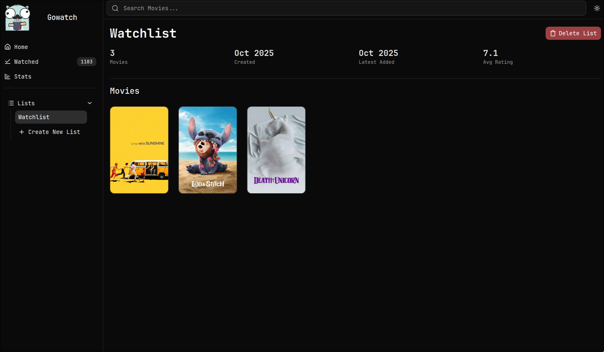

# Gowatch

[](https://github.com/marcosalvi-01/gowatch/actions)
[](https://ghcr.io/marcosalvi-01/gowatch)
[](https://golang.org/)
[](https://www.gnu.org/licenses/gpl-3.0)

A self-hosted web application for tracking movies you've watched, creating custom watchlists, and viewing detailed statistics. Built with Go and integrated with The Movie Database (TMDB) API.

## Features

- **Movie Tracking**: Log movies you've watched with dates and theater/home viewing options
- **Custom Lists**: Create and manage personalized movie lists (watchlists, favorites, etc.)
- **Movie Search**: Search for movies using TMDB's extensive database
- **Detailed Movie Pages**: View comprehensive movie information including cast, genres, and ratings
- **Statistics Dashboard**: Analyze your watching habits with charts and metrics
- **Responsive Design**: Modern, mobile-friendly interface built with Tailwind CSS
- **HTMX Integration**: Fast, dynamic interactions without complex JavaScript

## Screenshots

### Search


### Movie Details


### Lists



### Statistics


## Installation

### Docker (Recommended)

1. Create a `.env` file with your TMDB API key:

   ```env
   TMDB_API_KEY=your_tmdb_api_key_here
   ```

2. Run with Docker Compose:
   ```bash
   docker-compose up -d
   ```

The application will be available at `http://localhost:8080`.

### Local Development

1. Ensure you have Go 1.25.3+ and Node.js/npm installed.

2. Clone the repository and install dependencies:

   ```bash
   git clone https://github.com/yourusername/gowatch.git
   cd gowatch
   make setup
   ```

3. Create a `.env` file with your TMDB API key:

   ```env
   TMDB_API_KEY=your_tmdb_api_key_here
   ```

4. Start the development server:
   ```bash
   make dev
   ```

The application will be available at `http://localhost:8080`.

## Usage

- **Home**: Overview dashboard
- **Watched**: View movies grouped by watch date
- **Search**: Find movies to add to your lists
- **Movie Details**: Click any movie for full information and watch history
- **Lists**: Create and manage custom movie collections
- **Stats**: View comprehensive watching statistics and trends

## Development

### Prerequisites

- Go 1.25.3+
- Node.js and npm
- TMDB API key (get one at [TMDB](https://www.themoviedb.org/settings/api))

### Setup

1. Install dependencies:

   ```bash
   make setup
   ```

2. Start development server with hot reload:
   ```bash
   make dev
   ```

### Build Commands

- `make build`: Build the application
- `make vet`: Run linting and checks
- `make clean`: Clean build artifacts

### Project Structure

- `db/`: Database migrations and queries
- `internal/handlers/`: HTTP request handlers
- `internal/models/`: Data structures
- `internal/services/`: Business logic
- `internal/ui/`: Templ templates and components
- `logging/`: Logging utilities

## License

This project is licensed under the GNU General Public License v3.0 - see the [LICENSE](LICENSE) file for details.
